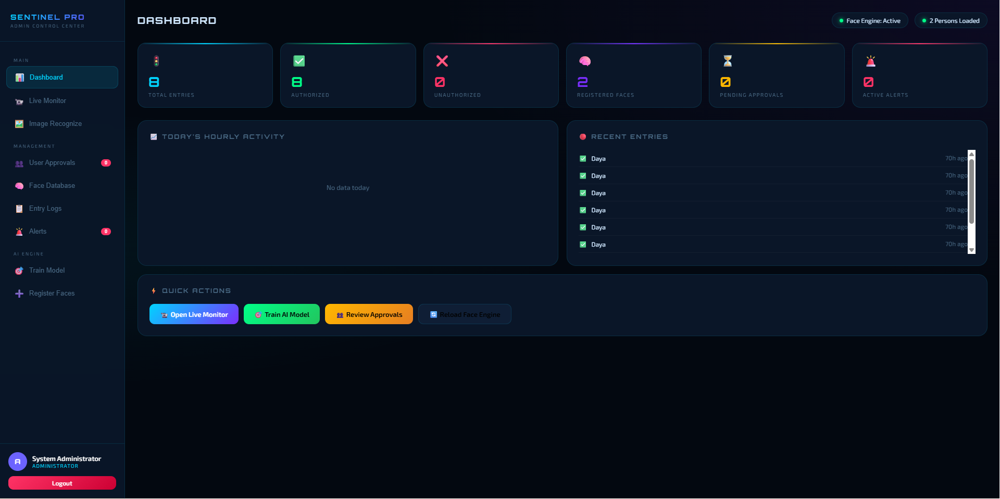
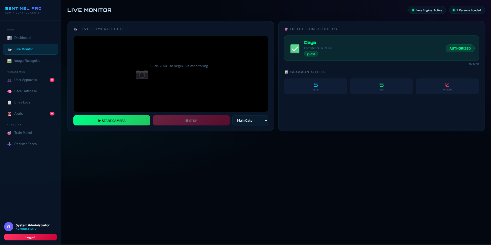

# AI-Based Event Authentication System (Sentinel Pro)

## 📌 Description
Sentinel Pro is a real-time AI-based face recognition system used for event security and authentication.  
It allows admins to monitor entries, manage users, and detect faces using AI.

## 🚀 Features
- Face Recognition (AI mode using dlib)
- Demo Mode (works without heavy libraries)
- Admin Dashboard
- User Registration & Approval
- Entry Logs & Alerts
- Dataset Training System
## 📸 Screenshots
### 🔐 Login Page


### 🧑‍💼 Admin Dashboard


### 🎥 Face Recognition in Action

## ⚙️ Installation

```bash
pip install -r requirements.txt
python app.py